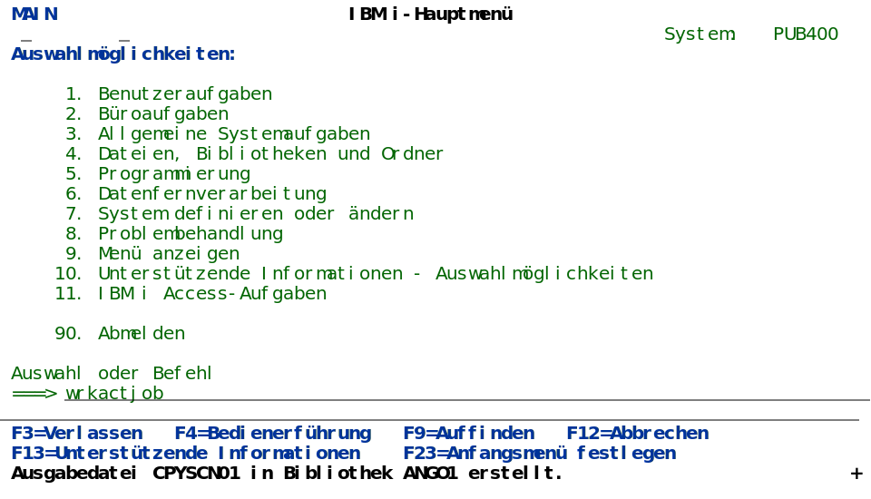

# AG1965.github.io - Blog of Anton Gombkötö

## 2026-02-08
added https://github.com/AG1965/markMaidViewer which was improved by BOB.

## 2026-02-03  
Got my API key and started to play with BOB

## 2026-01-12
The next BOB-love-story - but not with RPG, after Python, it's now bash!
Folks, nobody needs (or better: will pay) BOB for Python, bash and so on.
https://midrange.de/bob-ich-bin-dein-fan/

## 2025-12-28
https://github.com/AG1965/CPYSCN2SVG allows you to convert outfiles created with STRCPYSCN to svg-files, like this one:

## 2025-12-21

created this blog.

## 2025-12

Installed ollama and qwen3:4b. Works in VS Code.

* https://www.exxactcorp.com/blog/deep-learning/run-llms-locally-with-continue-vs-code-extension
* https://ollama.com/download/windows
* https://docs.continue.dev/customize/model-providers/top-level/ollama
* Adam Shedivy does it on IBM i: https://ajshedivy.notion.site/

## 2025-11

New computer with Windows 11.
